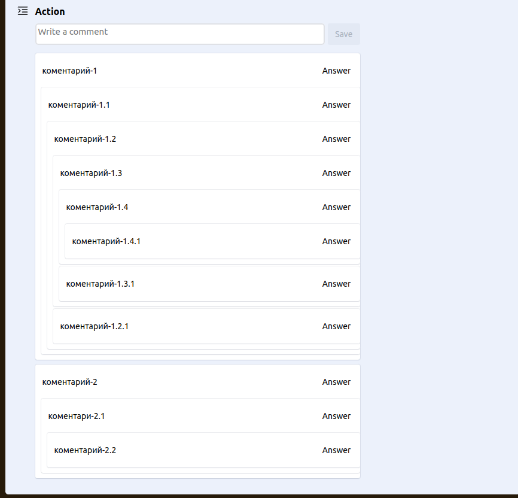
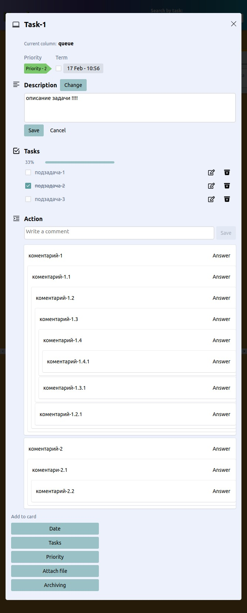

# Kanban

Запуск проекта:
1. npm install
2. npm start

## Стек технологий

- React, TypeScript
- Styled-Components
- Redux
- LocalStorage

## Реализовано
- Все данные сохраняются в LocalStorage.
- Проект содержит 2 страницы:
    - Страница с выбором проекта
    - Страница с задачами
- Каждая доска имеет 3 колонки c возможностью изменения статуса с помощью drag-n-drop: 
    - Queue
    - Development
    - Done
- Возможность выбора цвета Background для доски.
- Возможность создавать/удалять задачу.
- Возможность создавать/удалять доску.
- Возможность редактирования задачи.
- Адаптация под мобильные устройства.
- Поиск по номеру задачи.
- Каждая задача имеет:
    - Номер задачи
    - Заголовок
    - Описание
    - Дата создания
    - Время в работе
    - Дата окончания
    - Приоритет
    - Вложенные файлы
    - Текущий статус
    - Возможность добавлять подзадачи;
    - Система каскадных комментариев(т.е. Можно оставить комментарий под коментарием под комментарием...
      Пример можно увидеть на reddit или picabu)

## Оформление приложения 

- Создание Доски, выбор цвета Background.

- Поиск Задач, по клику на задачу переходит в проект в котором она находиться, И открывает ее в модальном окне.

 
- Удаление Досок.

- Модальное Окно редактирования задачи.

- Метка Приоритета.

- Срок задачи, дата создания задачи, время в работе.

- #### Отслеживание:
1. Количество коментариев.
2. Метка приоритета.
3. Срок задачи.
4. Количество выполненных и не выполненных подзадач.
5. Номер задачи.
6. Название Задачи.

- Адаптивная верстка:

